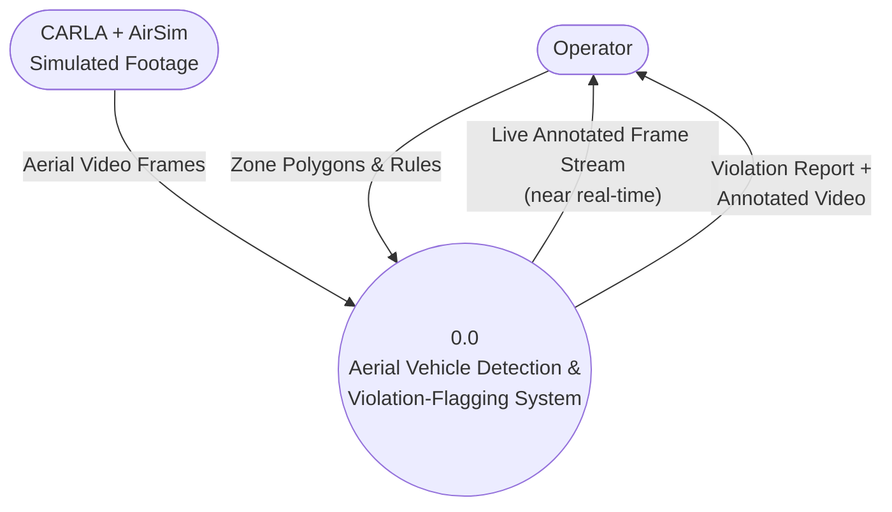
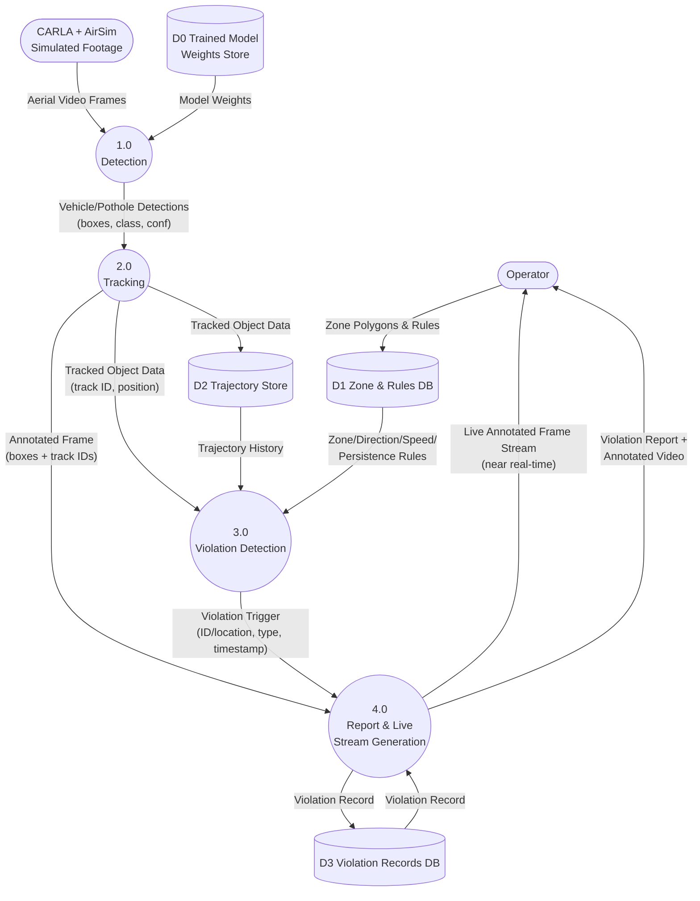
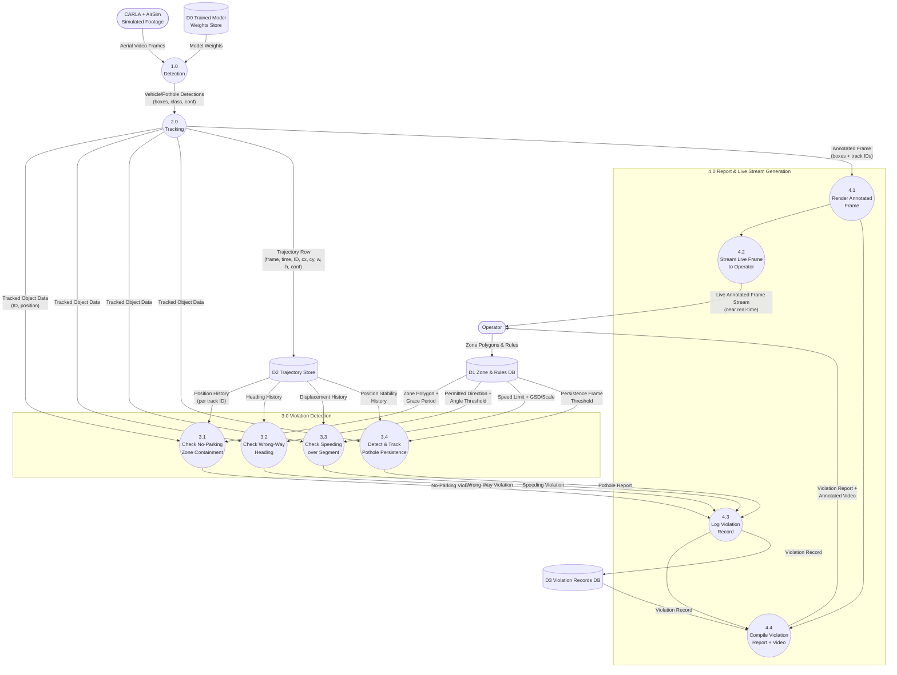

# Data Flow Diagrams — Aerial Vehicle Detection & Violation-Flagging Pipeline

Derived from [First_Phase_Plan.md](First_Phase_Plan.md) and the current implementation under `ml/` and `simulation/`. Reflects the actual runtime flow: **CARLA + AirSim footage → model (detection) → tracking → violation trigger → report**, with two outputs — a near-real-time live annotated stream, and a final violation report + annotated video.

**Level 0** is a minimal context diagram (one process, external entities only), **Level 1** explodes that single process into its major numbered sub-processes, and **Level 2** explodes select Level-1 processes into their own numbered sub-processes.

---

## Level 0 — Context Diagram

Minimal: one process, its external entities, nothing else.

---

## Level 1 — Major Processes (explanation of 0.0)

Straight-line flow: footage in → detection → tracking → violation trigger → report, with the report stage producing both the live view and the final packaged output.

---

## Level 2 — Process 3.0 & 4.0 Expanded

Everything from Level 1 is retained (both external entities, all four data stores, Processes 1.0/2.0), but **3.0 Violation Detection** (now including pothole persistence) and **4.0 Report & Live Stream Generation** are each exploded into their own numbered sub-processes.

---

## Notes

- **Level 0** deliberately shows only the operator (who configures zone/rule input and receives both outputs) and the CARLA+AirSim footage source — no internal data stores, matching the minimal reference style.
- **Level 1** is the straight-line runtime flow the system actually executes: footage → **1.0 Detection** → **2.0 Tracking** → **3.0 Violation Detection** → **4.0 Report & Live Stream Generation**. `D0` (trained model weights) is a pre-existing artifact consumed by 1.0, not a live pipeline stage — it's produced offline by the training process described in [First_Phase_Plan.md](First_Phase_Plan.md) Stage 1 (`ml/detection/train_full.py`) and isn't part of the runtime data flow.
- **Level 2** keeps every entity, store, and flow from Level 1 intact and expands two processes:
  - **3.0 Violation Detection** → 3.1 no-parking, 3.2 wrong-way, 3.3 speeding (Stage 4's logic table), plus **3.4 pothole detect & track** — a planned addition flagging a detected `pothole` class whose track stays positionally stable (near-zero displacement) past a persistence-frame threshold, reusing the same trajectory/track-ID mechanism as the vehicle checks.
  - **4.0 Report & Live Stream Generation** → 4.1 render the annotated frame (boxes/IDs/violation flags), which fans out to 4.2 (streamed live to the operator near real-time) and 4.4 (fed into the compiled output video); 4.3 logs each violation trigger to `D3`; 4.4 compiles the final violation report + annotated video from the logged records and rendered frames.
  - **1.0 Detection** and **2.0 Tracking** are left un-exploded (single nodes) in this pass.
- Per the plan's status table, trajectory extraction and detection/tracking are implemented; 3.1–3.4 (violation rules, including pothole) and the live-stream/report compilation in 4.0 are design targets, not shipped code yet. Pothole detection additionally requires a `pothole` class to be added to the detector's training data, which is not yet part of Stage 1's VisDrone-based class set.
