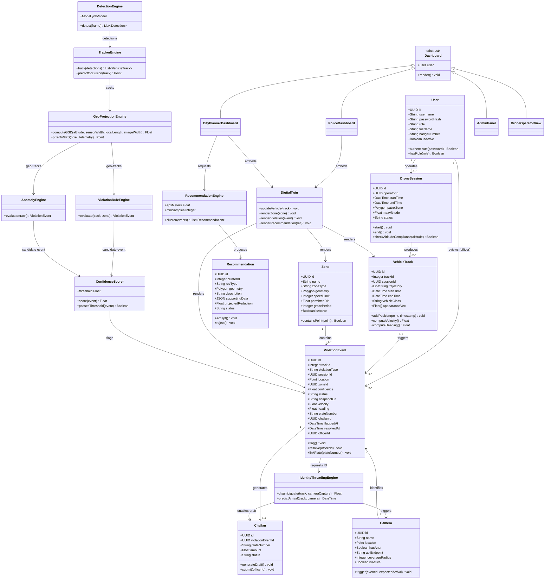
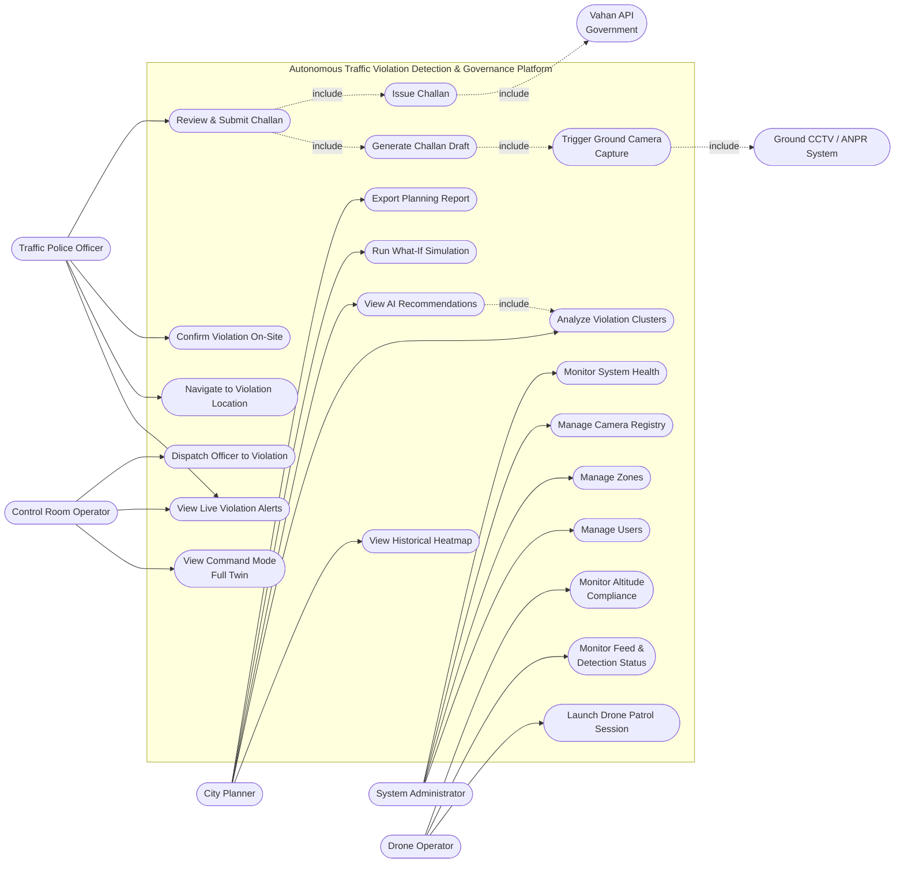

# Class Diagram & Use Case Diagram — Autonomous Traffic Violation Detection & Urban Planning System

Derived from [Product_Requirements_Document.md](Product_Requirements_Document.md) (System Architecture §10, Database Design §13, API Design §14, User Personas §7, Usage Scenarios §8, Objective-wise Solutions §6). These describe the full target platform the PRD specifies — a superset of what's currently implemented under `ml/`/`simulation/` (see [DFD_Diagrams.md](DFD_Diagrams.md) for the as-built pipeline).

---

## Class Diagram

Domain entities are drawn from the PostGIS schema (§13.1); pipeline/engine classes are drawn from the architecture layers (§10) and objective-wise technical approaches (§6). Dashboards map to the role-based presentation layer (§10.2, §12).

---

## Use Case Diagram

Actors from §7 (User Personas); use cases synthesized from §8 (Usage Scenarios) and the role column of §14.1 (API Design).

---

## Notes

- **Class diagram** entities (`User`, `DroneSession`, `Zone`, `VehicleTrack`, `ViolationEvent`, `Camera`, `Recommendation`) map 1:1 to the PostgreSQL/PostGIS tables in PRD §13.1; `Challan` is implied by `violation_events.challan_id` and the challan lifecycle in §11.2 but has no dedicated table in the current schema draft, so it's modeled here as its own class for clarity. Engine classes (`DetectionEngine` → `TrackerEngine` → `GeoProjectionEngine` → `ViolationRuleEngine`/`AnomalyEngine` → `ConfidenceScorer` → `IdentityThreadingEngine`) mirror the pipeline layers in §10.1/§10.2 and the per-objective technical approaches in §6.
- **Use case diagram** actors are the five personas in §7. `UC19`–`UC21` (challan draft generation, ground camera trigger, challan issuance) are modeled as system-internal use cases included from `UC4 Review & Submit Challan`, per the violation event lifecycle in §11.2 and the external integrations in §14.3 (`ANPR` = Ground CCTV Trigger API, `Vahan` = Vahan API).
- This PRD describes a considerably larger platform (dual dashboards, digital twin, hybrid enforcement, DBSCAN planning engine, full backend/DB stack) than what's currently implemented — see [First_Phase_Plan.md](First_Phase_Plan.md) and [DFD_Diagrams.md](DFD_Diagrams.md) for the as-built Phase 1 scope (detection + tracking + violation-flagging on aerial footage, no backend/dashboard/digital twin yet).
