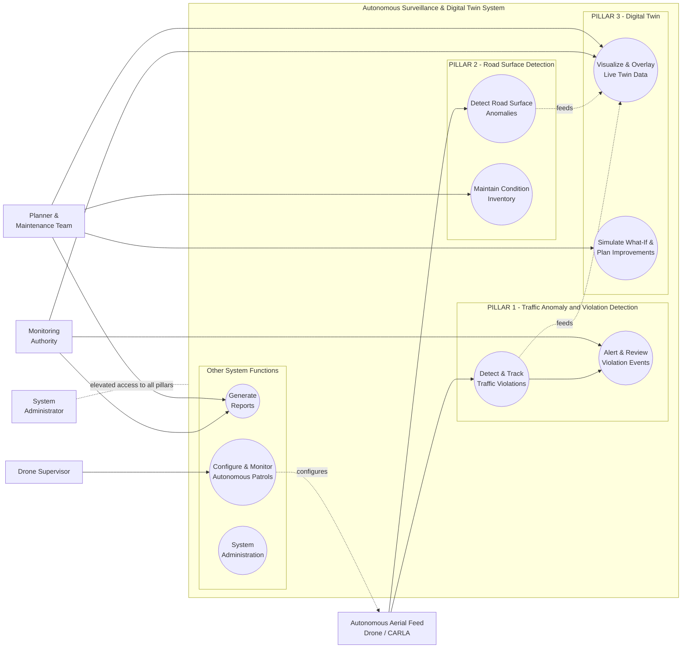

# Use Case Diagram — Master Overview
## Autonomous Aerial Surveillance Framework for Traffic Anomaly Detection and Digital Twin-Based Urban Planning

> Companion diagram set for [Product_Requirements_Document.md](../Product_Requirements_Document.md).
> Notation: `[ Actor ]` = human or external system actor, `(( Use Case ))` = system functionality, subgraph = system boundary.

---

## How to Read This Diagram Set

This file is the **master overview** — the whole system on one screen. Each of the **three core pillars** also has its own **standalone, fully detailed use case diagram** in its own file, so it can be read, explained, and presented independently:

| File | Scope |
|---|---|
| `01_Use_Case_Diagram.md` (this file) | Master overview — all pillars + actors, one screen |
| [`01a_Use_Case_Diagram_Violation_Detection.md`](01a_Use_Case_Diagram_Violation_Detection.md) | **Pillar 1** — Traffic Anomaly & Violation Detection, full detail |
| [`01b_Use_Case_Diagram_Digital_Twin.md`](01b_Use_Case_Diagram_Digital_Twin.md) | **Pillar 3** — Digital Twin (Visualization + Simulation & Planning), full detail |
| [`01c_Use_Case_Diagram_Road_Surface_Detection.md`](01c_Use_Case_Diagram_Road_Surface_Detection.md) | **Pillar 2** — Road Surface Detection, full detail |

The system is built around these three pillars; the Digital Twin is where both detection pillars' output ends up being seen and acted on. Reporting, autonomous patrol supervision, and admin tasks are real but supporting — they stay condensed into one small cluster here rather than getting their own diagram.

---

## Actors

| Actor | Description |
|---|---|
| Monitoring Authority | Traffic officer / control room staff who view the twin and respond to alerts |
| Planner & Maintenance Team | City planner + maintenance engineer — consume the twin for planning and road condition decisions |
| Drone Supervisor | Configures patrol zones/schedules and monitors the autonomous drone's status — does not manually pilot it |
| System Administrator | Manages users, zones, and system health |
| Autonomous Aerial Feed (Drone / CARLA) | Secondary system actor — the drone flies pre-planned patrol routes on its own and supplies the video + telemetry that drives both detection engines |

---

## Master Use Case Diagram

### Use Case Summary Table

| # | Use Case | Pillar | See Full Detail In |
|---|---|---|---|
| UC1 | Detect & Track Traffic Violations | 1 — Violation Detection | `01a_Use_Case_Diagram_Violation_Detection.md` |
| UC2 | Alert & Review Violation Events | 1 — Violation Detection | `01a_Use_Case_Diagram_Violation_Detection.md` |
| UC3 | Detect Road Surface Anomalies | 2 — Road Surface Detection | `01c_Use_Case_Diagram_Road_Surface_Detection.md` |
| UC4 | Maintain Condition Inventory | 2 — Road Surface Detection | `01c_Use_Case_Diagram_Road_Surface_Detection.md` |
| UC5 | Visualize & Overlay Live Twin Data | 3 — Digital Twin | `01b_Use_Case_Diagram_Digital_Twin.md` |
| UC6 | Simulate What-If & Plan Improvements | 3 — Digital Twin | `01b_Use_Case_Diagram_Digital_Twin.md` |
| UC7 | Generate Reports | Other | — |
| UC8 | Configure & Monitor Autonomous Patrols | Other | — |
| UC9 | System Administration | Other | — |

---

## Diagram Index

| # | Diagram | File | Status |
|---|---|---|---|
| 1 | Use Case Diagram — Master Overview | `01_Use_Case_Diagram.md` | ✅ Done |
| 1a | Use Case Diagram — Violation Detection (Pillar 1) | `01a_Use_Case_Diagram_Violation_Detection.md` | ✅ Done |
| 1b | Use Case Diagram — Digital Twin (Pillar 3) | `01b_Use_Case_Diagram_Digital_Twin.md` | ✅ Done |
| 1c | Use Case Diagram — Road Surface Detection (Pillar 2) | `01c_Use_Case_Diagram_Road_Surface_Detection.md` | ✅ Done |
| 2 | Class Diagram set (4 files) | `02_Class_Diagram*.md` | ✅ Done |
| 3 | DFD Level 0 | `03_DFD_Level_0.md` | ✅ Done |
| 4 | DFD Level 1 | `04_DFD_Level_1.md` | ✅ Done |
| 5 | DFD Level 2 | `05_DFD_Level_2.md` | ✅ Done |
| 6 | Full System Architecture Diagram | `06_System_Architecture_Diagram.md` | ✅ Done |
