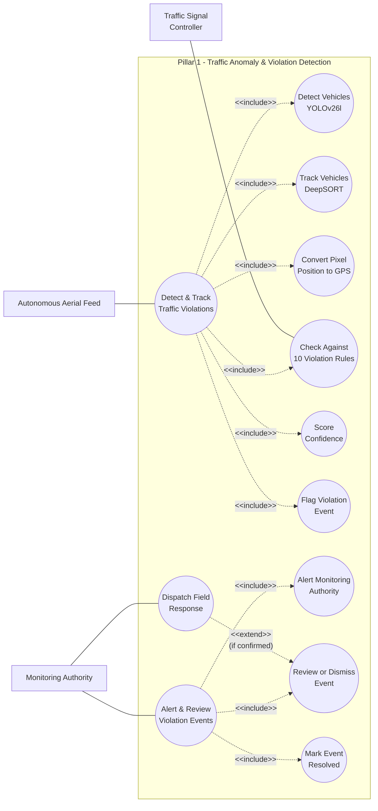

# Use Case Diagram — Pillar 1: Traffic Anomaly & Violation Detection
## Autonomous Aerial Surveillance Framework for Traffic Anomaly Detection and Digital Twin-Based Urban Planning

> Part of the [Use Case Diagram set](01_Use_Case_Diagram.md) · Companion to [Product_Requirements_Document.md](../Product_Requirements_Document.md)
> Notation: `[ Actor ]` = human or external system actor · `(( Use Case ))` = system functionality · plain line = association · dashed arrow `<<include>>` = base use case always performs the included one · dashed arrow `<<extend>>` = optional/conditional behavior · subgraph = system boundary.

---

## Scope

This diagram covers everything involved in turning raw aerial footage into a reviewed, actioned traffic violation event — the full depth behind UC1–UC2 in the master overview. Detection uses **YOLOv26l** for vehicle detection and DeepSORT for cross-frame tracking, evaluated against the 10 violation types defined in PRD Section 9.1.

---

## Actors

| Actor | Description |
|---|---|
| Autonomous Aerial Feed (Drone / CARLA) | Supplies the continuous video + telemetry stream from an autonomously flown patrol route |
| Traffic Signal Controller | Secondary system actor — supplies live signal state (RED/GREEN/YELLOW) used by red-light-jump detection |
| Monitoring Authority | Traffic officer / control room staff who receive, review, and act on flagged events |

---

## Use Case Diagram

---

## Use Case Details

| Use Case | Description |
|---|---|
| **Detect & Track Traffic Violations** (UC1) | Primary use case — includes D1–D6 below |
| **Alert & Review Violation Events** (UC2) | Primary use case — includes D7, D8, D10 below; D9 extends D8 when the event is confirmed |
| Detect Vehicles | YOLOv26l runs inference per frame — outputs bounding boxes, class, confidence |
| Track Vehicles | DeepSORT assigns and maintains a unique Track ID across frames using appearance + Kalman filter prediction |
| Convert Pixel Position to GPS | Homography + drone telemetry projects each tracked vehicle to a real-world GPS coordinate |
| Check Against 10 Violation Rules | The 30-frame trajectory buffer is evaluated against no-parking, wrong-way, illegal U-turn, red-light jumping, speeding, lane violation, zebra crossing, helmet-less riding, overloading, and illegal stopping |
| Score Confidence | Each candidate violation receives a confidence score |
| Flag Violation Event | Scored event written to `violation_events` with GPS, timestamp, and snapshot |
| Alert Monitoring Authority | Event pushed via WebSocket to the live Monitoring Dashboard |
| Review or Dismiss Event | A human checks the event and confirms or dismisses it, with a reason logged either way |
| Dispatch Field Response | Confirmed event routed to a field responder for on-ground verification |
| Mark Event Resolved | Event closed on the digital twin and retained for historical reporting/clustering |

---

## Related Diagrams

| Diagram | Relationship |
|---|---|
| [Master Use Case Diagram](01_Use_Case_Diagram.md) | System-wide overview this diagram zooms into |
| [Digital Twin Use Case Diagram](01b_Use_Case_Diagram_Digital_Twin.md) | Where flagged violation events are visualized (UC6 there) |
| PRD [Section 9.1](../Product_Requirements_Document.md#9-violation-types--road-surface-anomaly-categories) | Full definition of all 10 violation types |
