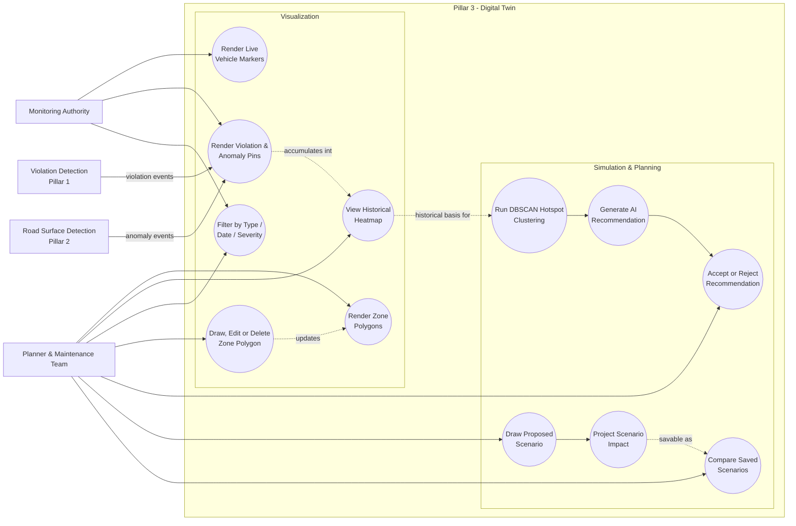

# Use Case Diagram — Pillar 3: Digital Twin
## Autonomous Aerial Surveillance Framework for Traffic Anomaly Detection and Digital Twin-Based Urban Planning

> Part of the [Use Case Diagram set](01_Use_Case_Diagram.md) · Companion to [Product_Requirements_Document.md](../Product_Requirements_Document.md)
> Notation: `[ Actor ]` = human or external system actor, `(( Use Case ))` = system functionality, subgraph = system boundary.

---

## Scope

This diagram covers the Digital Twin in full — the shared 3D environment (CesiumJS) that both detection pillars feed into, and the two things people actually do with it: **look at what's happening / what happened** (Visualization) and **test what a proposed change would do** (Simulation & Planning). Full detail behind UC5–UC6 in the master overview.

---

## Actors

| Actor | Description |
|---|---|
| Monitoring Authority | Views the live twin and the events overlaid on it |
| Planner & Maintenance Team | Uses historical views, zone management, and the simulation tools for planning decisions |
| Violation Detection (Pillar 1) | System source — feeds flagged violation events onto the twin |
| Road Surface Detection (Pillar 2) | System source — feeds flagged road anomaly events onto the twin |

---

## Use Case Diagram

---

## Use Case Details

### Visualization

| Use Case | Description |
|---|---|
| Render Live Vehicle Markers | Tracked vehicle positions updated on the twin at 10Hz via WebSocket |
| Render Violation & Anomaly Pins | Flagged events from both detection pillars shown as geo-tagged markers, colour/icon-coded by type and status |
| Render Zone Polygons | No-parking, speed, intersection, and other rule zones shown as coloured overlays |
| View Historical Heatmap | Density-coded overlay of accumulated events over a selected date range |
| Filter by Type / Date / Severity | Narrows what's shown on the twin at any given moment |
| Draw, Edit or Delete Zone Polygon | Zones are editable directly on the twin and take effect immediately — no pipeline restart needed |

### Simulation & Planning

| Use Case | Description |
|---|---|
| Run DBSCAN Hotspot Clustering | Spatial clustering over historical violation/anomaly events, run on demand or weekly |
| Generate AI Recommendation | Rule engine maps a cluster's profile (violation-type mix or anomaly severity) to a suggested infrastructure action |
| Accept or Reject Recommendation | Planner reviews a recommendation and records a decision |
| Draw Proposed Scenario | Planner sketches a change — new signal, one-way conversion, lane closure, drainage fix — directly on the twin |
| Project Scenario Impact | System estimates the effect by matching the drawn change against the segment's own historical event data |
| Compare Saved Scenarios | Multiple proposed changes for the same segment saved and reviewed side by side |

---

## Related Diagrams

| Diagram | Relationship |
|---|---|
| [Master Use Case Diagram](01_Use_Case_Diagram.md) | System-wide overview this diagram zooms into |
| [Violation Detection Use Case Diagram](01a_Use_Case_Diagram_Violation_Detection.md) | Source of the violation events rendered here |
| [Road Surface Detection Use Case Diagram](01c_Use_Case_Diagram_Road_Surface_Detection.md) | Source of the road anomaly events rendered here |
| PRD [Section 18 — Digital Twin Design](../Product_Requirements_Document.md#18-digital-twin-design) | Full design detail |
| PRD [Section 21 — Intelligent Urban Planning & Recommendation Engine](../Product_Requirements_Document.md#21-intelligent-urban-planning--recommendation-engine) | Full clustering/recommendation/what-if logic |
