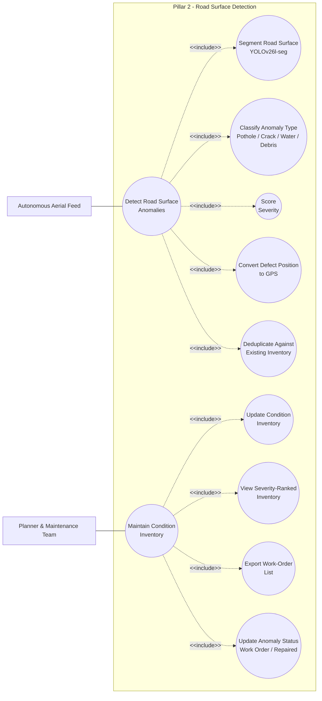

# Use Case Diagram — Pillar 2: Road Surface Detection
## Autonomous Aerial Surveillance Framework for Traffic Anomaly Detection and Digital Twin-Based Urban Planning

> Part of the [Use Case Diagram set](01_Use_Case_Diagram.md) · Companion to [Product_Requirements_Document.md](../Product_Requirements_Document.md)
> Notation: `[ Actor ]` = human or external system actor · `(( Use Case ))` = system functionality · plain line = association · dashed arrow `<<include>>` = base use case always performs the included one · subgraph = system boundary.

---

## Scope

This diagram covers everything involved in turning raw aerial footage into a severity-ranked, maintenance-ready road condition inventory entry — the full depth behind UC3–UC4 in the master overview. Detection uses **YOLOv26l-seg** for pixel-level defect segmentation, covering the four anomaly categories defined in PRD Section 9.2: potholes, cracking, waterlogging, and debris/obstruction.

---

## Actors

| Actor | Description |
|---|---|
| Autonomous Aerial Feed (Drone / CARLA) | Supplies the continuous video + telemetry stream from an autonomously flown patrol route |
| Planner & Maintenance Team | Views the condition inventory, exports work orders, and updates repair status |

---

## Use Case Diagram

---

## Use Case Details

| Use Case | Description |
|---|---|
| **Detect Road Surface Anomalies** (UC3) | Primary use case — includes A1–A5 below |
| **Maintain Condition Inventory** (UC4) | Primary use case — includes A6–A9 below |
| Segment Road Surface | YOLOv26l-seg produces a pixel-level defect mask per frame |
| Classify Anomaly Type | Mask classified as pothole, crack, waterlogging, or debris/obstruction |
| Score Severity | Severity computed from defect area (via Ground Sampling Distance) and class weighting — Low / Medium / High |
| Convert Defect Position to GPS | Homography + drone telemetry projects the defect centroid to a real-world GPS coordinate |
| Deduplicate Against Existing Inventory | PostGIS proximity check (`ST_DWithin`) avoids re-logging the same defect on every patrol pass |
| Update Condition Inventory | New defect inserted, or `recurrence_count` / severity trend updated on an existing one |
| View Severity-Ranked Inventory | Maintenance team browses defects sorted by severity and recurrence |
| Export Work-Order List | Prioritised list exported (Excel) for repair crew dispatch |
| Update Anomaly Status | Marked "work order issued" or "repaired", closing the loop on that defect |

---

## Related Diagrams

| Diagram | Relationship |
|---|---|
| [Master Use Case Diagram](01_Use_Case_Diagram.md) | System-wide overview this diagram zooms into |
| [Digital Twin Use Case Diagram](01b_Use_Case_Diagram_Digital_Twin.md) | Where flagged road anomalies are visualized as severity-coded pins |
| PRD [Section 9.2](../Product_Requirements_Document.md#9-violation-types--road-surface-anomaly-categories) | Full definition of all 4 road surface anomaly categories |
