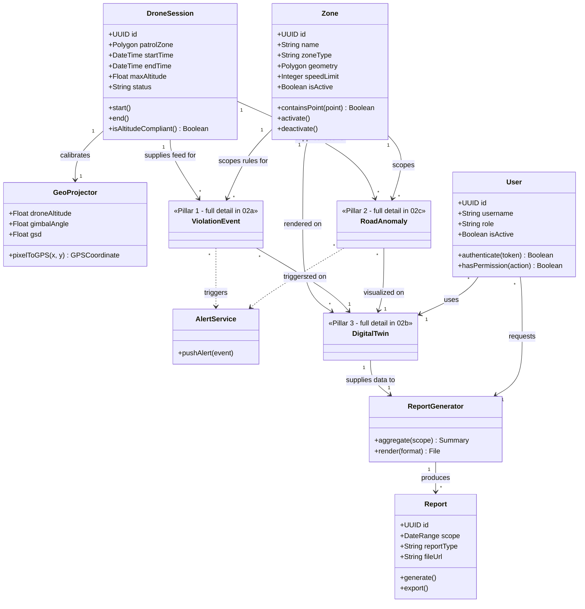

# Class Diagram — Master Overview
## Autonomous Aerial Surveillance Framework for Traffic Anomaly Detection and Digital Twin-Based Urban Planning

> Companion diagram set for [Product_Requirements_Document.md](../Product_Requirements_Document.md).
> Uses Mermaid's native `classDiagram` syntax. Multiplicity is shown as `"1"`, `"*"` etc. on each end of a relationship.

---

## How to Read This Diagram Set

Same structure as the [Use Case Diagram set](01_Use_Case_Diagram.md): **4 diagrams total** — this master overview plus one fully detailed class diagram per pillar. Every class from the full feature list lives in exactly one of these four files; nothing is dropped for simplicity, it's just organized so each diagram stays readable.

| File | Scope |
|---|---|
| `02_Class_Diagram.md` (this file) | Master overview — shared/core classes + how each pillar connects to them |
| [`02a_Class_Diagram_Violation_Detection.md`](02a_Class_Diagram_Violation_Detection.md) | **Pillar 1** — Traffic Anomaly & Violation Detection, full detail |
| [`02b_Class_Diagram_Digital_Twin.md`](02b_Class_Diagram_Digital_Twin.md) | **Pillar 3** — Digital Twin, full detail |
| [`02c_Class_Diagram_Road_Surface_Detection.md`](02c_Class_Diagram_Road_Surface_Detection.md) | **Pillar 2** — Road Surface Detection, full detail |

The classes shown here in full (`Zone`, `DroneSession`, `GeoProjector`, `User`, `AlertService`, `ReportGenerator`, `Report`) are **shared across pillars** — they appear again as lightweight reference stubs (marked `<<shared>>`) inside each pillar diagram so that diagram is still self-contained and explainable on its own.

---

## Master Class Diagram

---

## Shared / Core Class Details

| Class | Purpose |
|---|---|
| `Zone` | Geo-fenced polygon defining where a rule (speed limit, permitted direction, grace period) applies. Feeds both detection pillars and is rendered on the twin. |
| `DroneSession` | One autonomous patrol run — start/end time, patrol area, altitude compliance. Is the source of the raw frame stream both detection pillars consume. |
| `GeoProjector` | Converts a pixel position in a frame to a real-world GPS coordinate using drone telemetry. Used identically by both detection pillars. |
| `User` | Any system user (Monitoring Authority, Planner/Maintenance, Drone Supervisor, Admin) — role drives what they can see/do. |
| `AlertService` | Pushes a flagged event to the live dashboard over WebSocket, regardless of which pillar produced it. |
| `ReportGenerator` | Aggregates twin data (violations + anomalies + recommendations) into a structured, exportable `Report`. |
| `Report` | A generated PDF/Excel/GeoJSON document tied to a zone/date-range scope. |

---

## Diagram Index

| # | Diagram | File | Status |
|---|---|---|---|
| 1 | Use Case Diagram set (4 files) | `01_Use_Case_Diagram*.md` | ✅ Done |
| 2 | Class Diagram — Master Overview | `02_Class_Diagram.md` | ✅ Done |
| 2a | Class Diagram — Violation Detection (Pillar 1) | `02a_Class_Diagram_Violation_Detection.md` | ✅ Done |
| 2b | Class Diagram — Digital Twin (Pillar 3) | `02b_Class_Diagram_Digital_Twin.md` | ✅ Done |
| 2c | Class Diagram — Road Surface Detection (Pillar 2) | `02c_Class_Diagram_Road_Surface_Detection.md` | ✅ Done |
| 3 | DFD Level 0 | `03_DFD_Level_0.md` | ✅ Done |
| 4 | DFD Level 1 | `04_DFD_Level_1.md` | ✅ Done |
| 5 | DFD Level 2 | `05_DFD_Level_2.md` | ✅ Done |
| 6 | Full System Architecture Diagram | `06_System_Architecture_Diagram.md` | ✅ Done |
