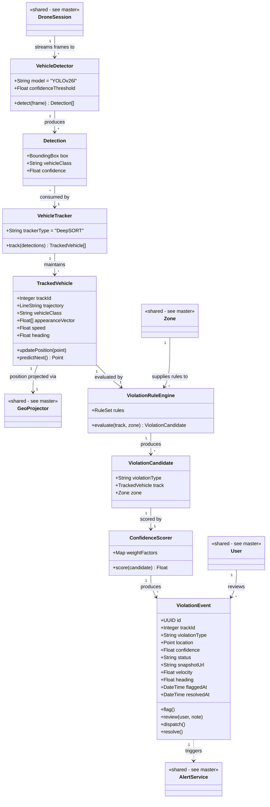

# Class Diagram — Pillar 1: Traffic Anomaly & Violation Detection
## Autonomous Aerial Surveillance Framework for Traffic Anomaly Detection and Digital Twin-Based Urban Planning

> Part of the [Class Diagram set](02_Class_Diagram.md) · Companion to [Product_Requirements_Document.md](../Product_Requirements_Document.md)
> Uses Mermaid's native `classDiagram` syntax. Classes marked `<<shared>>` are defined in full in the [master overview](02_Class_Diagram.md).

---

## Scope

The complete class model behind turning a raw aerial frame into a reviewed `ViolationEvent` — detection (`VehicleDetector`, using **YOLOv26l**), tracking (`VehicleTracker`, DeepSORT), rule evaluation, and confidence scoring.

---

## Class Diagram

---

## Class Details

| Class | Purpose |
|---|---|
| `VehicleDetector` | Wraps YOLOv26l — runs inference on each incoming frame, returns raw detections |
| `Detection` | One detected object in a single frame: bounding box, class, confidence |
| `VehicleTracker` | Wraps DeepSORT — assigns and maintains a Track ID across frames using appearance + Kalman filter prediction |
| `TrackedVehicle` | A vehicle's running state across frames: trajectory, class, speed, heading, appearance embedding |
| `ViolationRuleEngine` | Evaluates a tracked vehicle's trajectory against the 10 violation rules (PRD Section 9.1), scoped by the zone it's in |
| `ViolationCandidate` | An unscored match against a violation rule, pending confidence scoring |
| `ConfidenceScorer` | Computes the final confidence score for a candidate |
| `ViolationEvent` | The persisted, reviewable record — everything downstream (alerts, twin, reports) reads from here |

---

## Related Diagrams

| Diagram | Relationship |
|---|---|
| [Master Class Diagram](02_Class_Diagram.md) | Shared classes (`Zone`, `DroneSession`, `GeoProjector`, `AlertService`, `User`) referenced here in full |
| [Digital Twin Class Diagram](02b_Class_Diagram_Digital_Twin.md) | `ViolationEvent` is visualized there |
| [Violation Detection Use Case Diagram](01a_Use_Case_Diagram_Violation_Detection.md) | Behavioural counterpart to this structural view |
