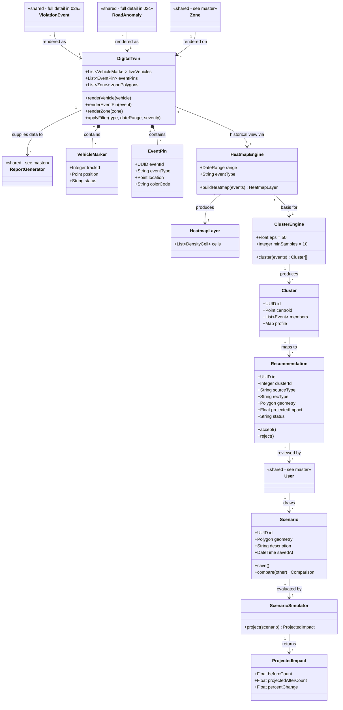

# Class Diagram — Pillar 3: Digital Twin
## Autonomous Aerial Surveillance Framework for Traffic Anomaly Detection and Digital Twin-Based Urban Planning

> Part of the [Class Diagram set](02_Class_Diagram.md) · Companion to [Product_Requirements_Document.md](../Product_Requirements_Document.md)
> Uses Mermaid's native `classDiagram` syntax. Classes marked `<<shared>>` are defined in full in the [master overview](02_Class_Diagram.md).

---

## Scope

The complete class model behind the Digital Twin: rendering live and historical data (`DigitalTwin`, `HeatmapEngine`), and turning that data into planning action (`ClusterEngine`, `Recommendation`, `Scenario`, `ScenarioSimulator`).

---

## Class Diagram

---

## Class Details

| Class | Purpose |
|---|---|
| `DigitalTwin` | The live 3D scene — holds vehicle markers, event pins, and zone polygons; the shared visual home for both detection pillars |
| `VehicleMarker` / `EventPin` | Lightweight render-ready representations of a tracked vehicle / a flagged event on the twin |
| `HeatmapEngine` | Aggregates historical events into a density-coded layer for a given date range/type |
| `ClusterEngine` | Runs DBSCAN over historical events to find spatial hotspots |
| `Cluster` | A group of nearby events with a computed profile (violation-type mix or anomaly severity) |
| `Recommendation` | A rule-engine suggestion derived from a cluster's profile — signal, resurfacing, drainage, etc. |
| `Scenario` | A planner-drawn proposed change, saved for later comparison |
| `ScenarioSimulator` | Projects a scenario's impact using the same segment's historical event data |

---

## Related Diagrams

| Diagram | Relationship |
|---|---|
| [Master Class Diagram](02_Class_Diagram.md) | Shared classes (`Zone`, `User`, `ReportGenerator`) referenced here in full |
| [Violation Detection Class Diagram](02a_Class_Diagram_Violation_Detection.md) | Source of `ViolationEvent` rendered here |
| [Road Surface Detection Class Diagram](02c_Class_Diagram_Road_Surface_Detection.md) | Source of `RoadAnomaly` rendered here |
| [Digital Twin Use Case Diagram](01b_Use_Case_Diagram_Digital_Twin.md) | Behavioural counterpart to this structural view |
