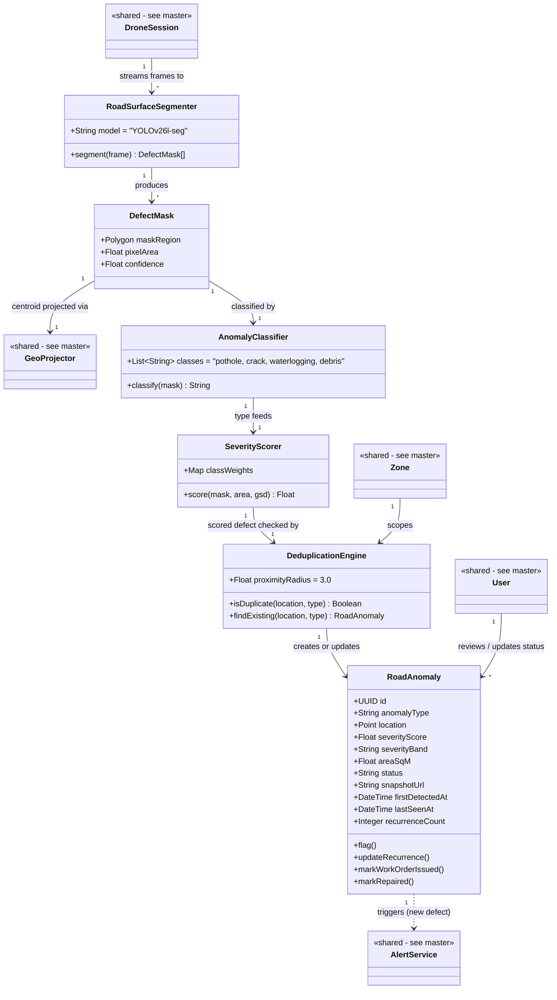

# Class Diagram — Pillar 2: Road Surface Detection
## Autonomous Aerial Surveillance Framework for Traffic Anomaly Detection and Digital Twin-Based Urban Planning

> Part of the [Class Diagram set](02_Class_Diagram.md) · Companion to [Product_Requirements_Document.md](../Product_Requirements_Document.md)
> Uses Mermaid's native `classDiagram` syntax. Classes marked `<<shared>>` are defined in full in the [master overview](02_Class_Diagram.md).

---

## Scope

The complete class model behind turning a raw aerial frame into a severity-ranked, maintenance-ready `RoadAnomaly` record — segmentation (`RoadSurfaceSegmenter`, using **YOLOv26l-seg**), classification, severity scoring, and deduplication across patrol sessions.

---

## Class Diagram

---

## Class Details

| Class | Purpose |
|---|---|
| `RoadSurfaceSegmenter` | Wraps YOLOv26l-seg — produces a pixel-level defect mask per frame |
| `DefectMask` | One segmented region in a single frame: shape, area, confidence |
| `AnomalyClassifier` | Classifies a defect mask into one of the four anomaly categories (PRD Section 9.2) |
| `SeverityScorer` | Computes a severity score from defect area (via Ground Sampling Distance) and class weighting |
| `DeduplicationEngine` | Checks a scored, geo-projected defect against the existing inventory using GPS proximity, so the same pothole isn't re-logged every patrol pass |
| `RoadAnomaly` | The persisted, reviewable record — tracks severity trend and recurrence over time, drives the maintenance work-order flow |

---

## Related Diagrams

| Diagram | Relationship |
|---|---|
| [Master Class Diagram](02_Class_Diagram.md) | Shared classes (`Zone`, `DroneSession`, `GeoProjector`, `AlertService`, `User`) referenced here in full |
| [Digital Twin Class Diagram](02b_Class_Diagram_Digital_Twin.md) | `RoadAnomaly` is visualized there |
| [Road Surface Detection Use Case Diagram](01c_Use_Case_Diagram_Road_Surface_Detection.md) | Behavioural counterpart to this structural view |
