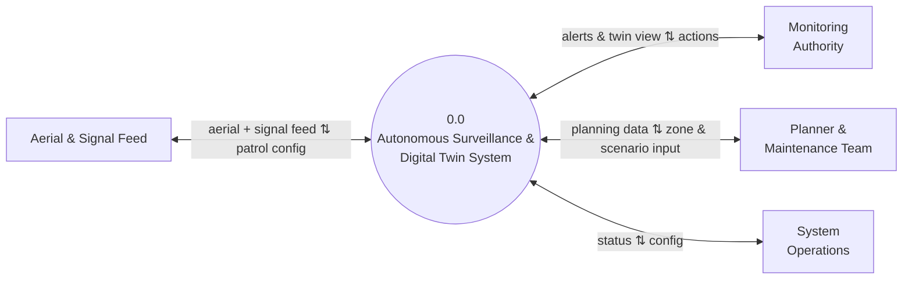

# DFD Level 0 — Context Diagram
## Autonomous Aerial Surveillance Framework for Traffic Anomaly Detection and Digital Twin-Based Urban Planning

> Companion diagram set for [Product_Requirements_Document.md](../Product_Requirements_Document.md).
> Notation: `[ Entity ]` = external entity, `(( Process ))` = process. Mermaid has no native DFD shape set, so `flowchart` is used to approximate it — consistent with the rest of this diagram set.

---

## Scope

DFD Level 0 (the context diagram) shows the **entire system as a single process**, surrounded by everything outside it that sends or receives data. This is the simplest diagram in the whole set — one bubble, four entities, four lines. Closely related entities are merged here (and stay merged in Level 1) since the distinction between them only matters once we get to Level 2 detail.

| Merged Entity | Combines |
|---|---|
| Aerial & Signal Feed | Autonomous Aerial Feed (Drone / CARLA) + Traffic Signal Controller |
| System Operations | Drone Supervisor + System Administrator |

---

## External Entities

| Entity | Type | Sends to System | Receives from System |
|---|---|---|---|
| Aerial & Signal Feed | System | Video frames, telemetry, live signal state | Patrol zone & schedule configuration |
| Monitoring Authority | Human | Review/dismiss decisions, dispatch actions | Live twin view, violation & anomaly alerts |
| Planner & Maintenance Team | Human | Zone edits, scenario input, recommendation decisions, report requests | Heatmaps, recommendations, condition inventory, reports |
| System Operations | Human | Patrol configuration, user & system configuration | Feed/altitude status, system health status |

---

## Context Diagram

---

## Diagram Index

| # | Diagram | File | Status |
|---|---|---|---|
| 1 | Use Case Diagram set (4 files) | `01_Use_Case_Diagram*.md` | ✅ Done |
| 2 | Class Diagram set (4 files) | `02_Class_Diagram*.md` | ✅ Done |
| 3 | DFD Level 0 — Context Diagram | `03_DFD_Level_0.md` | ✅ Done |
| 4 | DFD Level 1 — Major Processes | `04_DFD_Level_1.md` | ✅ Done |
| 5 | DFD Level 2 — Subprocess Detail | `05_DFD_Level_2.md` | ✅ Done |
| 6 | Full System Architecture Diagram | `06_System_Architecture_Diagram.md` | ✅ Done |
