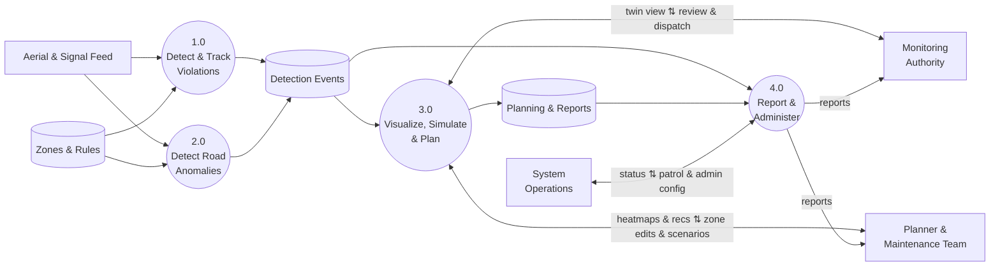

# DFD Level 1 — Major Processes
## Autonomous Aerial Surveillance Framework for Traffic Anomaly Detection and Digital Twin-Based Urban Planning

> Companion diagram set for [Product_Requirements_Document.md](../Product_Requirements_Document.md).
> Notation: `[ Entity ]` = external entity, `(( Process ))` = process, `[( Data Store )]` = data store.

---

## Scope

DFD Level 1 opens the single process from [DFD Level 0](03_DFD_Level_0.md) into its **four major internal processes** — the three core pillars plus the supporting-functions process. Each process gets decomposed further in [DFD Level 2](05_DFD_Level_2.md).

Kept simple on purpose: the same two merged entities from Level 0 carry through here, and the six data stores from the first draft are consolidated down to **three**, since the finer distinctions (violations vs. anomalies, recommendations vs. scenarios vs. reports) only need to exist once we reach Level 2.

---

## Processes

| # | Process | Pillar |
|---|---|---|
| 1.0 | Detect & Track Violations | Pillar 1 — Violation Detection |
| 2.0 | Detect Road Anomalies | Pillar 2 — Road Surface Detection |
| 3.0 | Visualize, Simulate & Plan | Pillar 3 — Digital Twin |
| 4.0 | Report & Administer | Supporting functions |

## Data Stores

| ID | Data Store | Holds |
|---|---|---|
| D1 | Zones & Rules | Zone polygons, speed limits, permitted directions |
| D2 | Detection Events | Flagged violations + flagged road anomalies (split apart in Level 2) |
| D3 | Planning & Reports | Recommendations, saved scenarios, generated reports (split apart in Level 2) |

---

## Level 1 Diagram

> Real-time process-to-process shortcuts (e.g. live detections streaming straight into the twin ahead of the database write) and the patrol-config relay to the feed are implementation detail — they're shown in [DFD Level 2](05_DFD_Level_2.md) instead of repeated here.

---

## Process Descriptions

| Process | What It Does |
|---|---|
| 1.0 — Detect & Track Violations | Runs vehicle detection/tracking on the aerial feed, checks trajectories against zone rules and signal state, flags violation events |
| 2.0 — Detect Road Anomalies | Segments the road surface in the aerial feed, classifies and scores defects, updates the condition inventory |
| 3.0 — Visualize, Simulate & Plan | Renders the live/historical twin, runs hotspot clustering, generates recommendations, and simulates what-if scenarios |
| 4.0 — Report & Administer | Aggregates data into reports, supervises autonomous patrol sessions, and handles user/system administration |

---

## Diagram Index

| # | Diagram | File | Status |
|---|---|---|---|
| 1 | Use Case Diagram set (4 files) | `01_Use_Case_Diagram*.md` | ✅ Done |
| 2 | Class Diagram set (4 files) | `02_Class_Diagram*.md` | ✅ Done |
| 3 | DFD Level 0 — Context Diagram | `03_DFD_Level_0.md` | ✅ Done |
| 4 | DFD Level 1 — Major Processes | `04_DFD_Level_1.md` | ✅ Done |
| 5 | DFD Level 2 — Subprocess Detail | `05_DFD_Level_2.md` | ✅ Done |
| 6 | Full System Architecture Diagram | `06_System_Architecture_Diagram.md` | ✅ Done |
