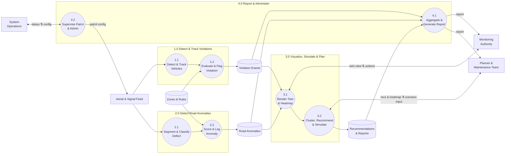

# DFD Level 2 — Subprocess Detail
## Autonomous Aerial Surveillance Framework for Traffic Anomaly Detection and Digital Twin-Based Urban Planning

> Companion diagram set for [Product_Requirements_Document.md](../Product_Requirements_Document.md).
> Notation: `[ Entity ]` = external entity, `(( Process ))` = process, `[( Data Store )]` = data store.

---

## Scope

DFD Level 2 opens each of the four [Level 1](04_DFD_Level_1.md) processes one step further — but kept to **one diagram, two subprocesses per process** (8 total) so it stays small and easy to read in one glance, instead of four separate detailed diagrams.

| Process | Split Into |
|---|---|
| 1.0 — Detect & Track Violations | 1.1 Detect & Track Vehicles → 1.2 Evaluate & Flag Violation |
| 2.0 — Detect Road Anomalies | 2.1 Segment & Classify Defect → 2.2 Score & Log Anomaly |
| 3.0 — Visualize, Simulate & Plan | 3.1 Render Twin & Heatmap → 3.2 Cluster, Recommend & Simulate |
| 4.0 — Report & Administer | 4.1 Aggregate & Generate Report → 4.2 Supervise Patrol & Admin |

---

## Level 2 Diagram

---

## Subprocess Descriptions

| Subprocess | What It Does |
|---|---|
| 1.1 Detect & Track Vehicles | YOLOv26l detects vehicles per frame; DeepSORT maintains a Track ID and GPS position across frames |
| 1.2 Evaluate & Flag Violation | Trajectory checked against the 10 violation rules and signal state, scored, and written to `Violation Events` |
| 2.1 Segment & Classify Defect | YOLOv26l-seg segments the road surface and classifies each defect (pothole/crack/water/debris) |
| 2.2 Score & Log Anomaly | Severity scored, geo-projected, deduplicated against existing entries, and written to `Road Anomalies` |
| 3.1 Render Twin & Heatmap | Live vehicle/event markers and the historical density heatmap, both drawn on the digital twin |
| 3.2 Cluster, Recommend & Simulate | DBSCAN hotspot clustering, rule-based recommendation generation, and what-if scenario simulation |
| 4.1 Aggregate & Generate Report | Rolls up violation/anomaly/recommendation data and renders a structured PDF/Excel/GeoJSON report |
| 4.2 Supervise Patrol & Admin | Applies patrol configuration to the autonomous feed and handles user/system administration |

---

## Diagram Index

| # | Diagram | File | Status |
|---|---|---|---|
| 1 | Use Case Diagram set (4 files) | `01_Use_Case_Diagram*.md` | ✅ Done |
| 2 | Class Diagram set (4 files) | `02_Class_Diagram*.md` | ✅ Done |
| 3 | DFD Level 0 — Context Diagram | `03_DFD_Level_0.md` | ✅ Done |
| 4 | DFD Level 1 — Major Processes | `04_DFD_Level_1.md` | ✅ Done |
| 5 | DFD Level 2 — Subprocess Detail | `05_DFD_Level_2.md` | ✅ Done |
| 6 | Full System Architecture Diagram | `06_System_Architecture_Diagram.md` | ✅ Done |
