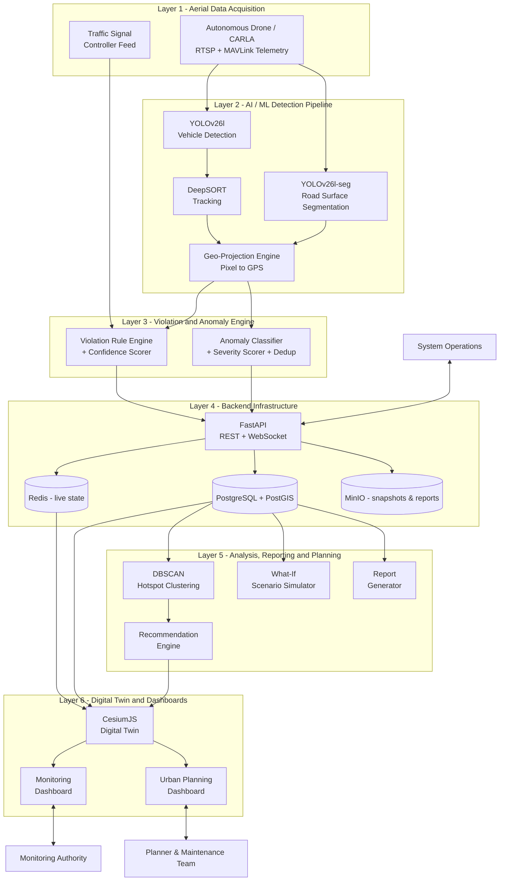

# Full System Architecture Diagram
## Autonomous Aerial Surveillance Framework for Traffic Anomaly Detection and Digital Twin-Based Urban Planning

> Companion diagram set for [Product_Requirements_Document.md](../Product_Requirements_Document.md).
> Consolidates the whole tech stack (PRD [Section 12](../Product_Requirements_Document.md#12-tech-stack)) into one picture: aerial acquisition → AI/ML processing → violation & anomaly detection → backend → analysis/planning → digital twin & dashboards.

---

## Scope

Unlike the other diagrams in this set, this one is intentionally the "full picture" — it's meant to be the single diagram that shows the complete technical path from a raw drone frame to a planner making a decision. To keep it readable despite covering more ground, it's organized into **six layers**, each its own subgraph, with data flowing top to bottom.

---

## Architecture Diagram

---

## Layer-by-Layer Summary

| Layer | Components | Role |
|---|---|---|
| 1 — Aerial Data Acquisition | Autonomous Drone / CARLA, Traffic Signal Feed | Supplies raw frames, telemetry, and signal state |
| 2 — AI / ML Detection Pipeline | YOLOv26l, DeepSORT, YOLOv26l-seg, Geo-Projection Engine | Turns raw frames into tracked vehicles and segmented road defects with real-world GPS coordinates |
| 3 — Violation & Anomaly Engine | Violation Rule Engine, Anomaly Classifier | Converts tracked/segmented output into scored, structured events |
| 4 — Backend Infrastructure | FastAPI, PostgreSQL + PostGIS, Redis, MinIO | Persists, caches, and serves all system data over REST/WebSocket |
| 5 — Analysis, Reporting & Planning | DBSCAN, Recommendation Engine, What-If Simulator, Report Generator | Turns historical data into hotspots, recommendations, projections, and reports |
| 6 — Digital Twin & Dashboards | CesiumJS Twin, Monitoring Dashboard, Urban Planning Dashboard | Where every pillar's output is actually seen and acted on |

---

## Diagram Index

| # | Diagram | File | Status |
|---|---|---|---|
| 1 | Use Case Diagram set (4 files) | `01_Use_Case_Diagram*.md` | ✅ Done |
| 2 | Class Diagram set (4 files) | `02_Class_Diagram*.md` | ✅ Done |
| 3 | DFD Level 0 — Context Diagram | `03_DFD_Level_0.md` | ✅ Done |
| 4 | DFD Level 1 — Major Processes | `04_DFD_Level_1.md` | ✅ Done |
| 5 | DFD Level 2 — Subprocess Detail | `05_DFD_Level_2.md` | ✅ Done |
| 6 | Full System Architecture Diagram | `06_System_Architecture_Diagram.md` | ✅ Done |
